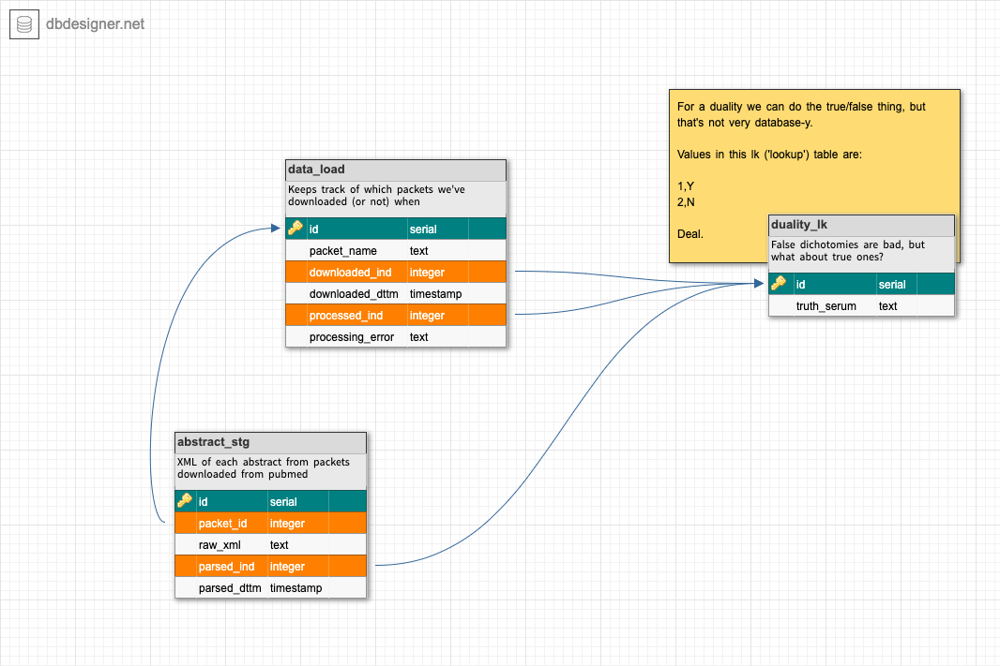

# pubmed
Data loads and data queries of pubmed information

Data model thus far:

The top of the model is for data loading from the pubmed ftp site.

The rest of the diagram is the model for pubmed article abstracts and metadata.

